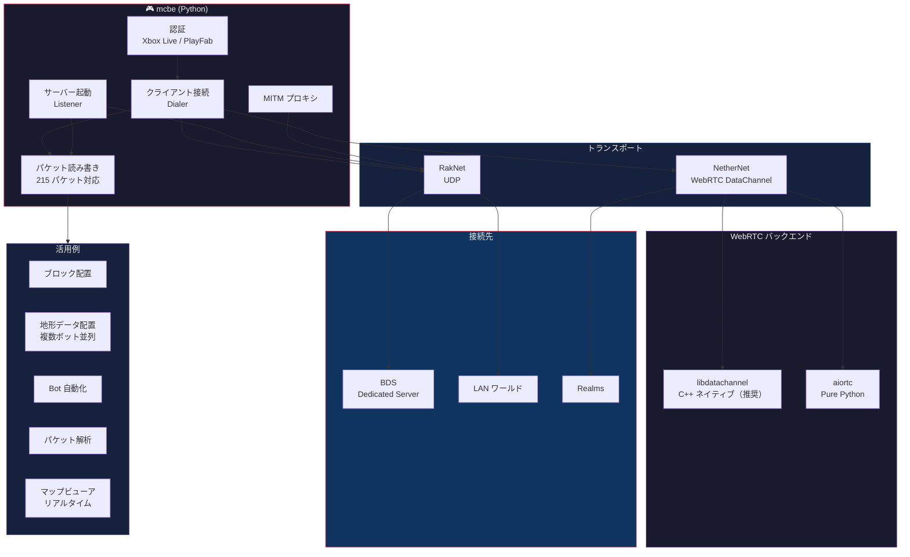

# はじめに

## mcbe でできること



## インストール

### 基本インストール

```bash
pip install mcbe
```

`pip install mcbe` だけで Realms 接続も可能です（aiortc が同梱されています）。

### libdatachannel バックエンド (推奨)

```bash
pip install mcbe[libdatachannel]
```

C++ ネイティブの WebRTC 実装で、Realms 接続がより高速・安定します。インストールすると自動的に優先使用されます。

> **注意:** aiortc は BDS 互換性のためモンキーパッチを適用しています。aiortc のバージョンアップで動作しなくなる可能性があるため、安定した Realms 接続には `mcbe[libdatachannel]` を推奨します。

### 開発用

```bash
pip install -e ".[dev]"
```

## クイックスタート

### クライアント接続 (最小構成)

```python
import asyncio
from mcbe.dial import Dialer
from mcbe.proto.login.data import IdentityData

async def main():
    dialer = Dialer(
        identity_data=IdentityData(display_name="Steve"),
    )
    async with await dialer.dial("127.0.0.1:19132") as conn:
        print("Connected!")
        while not conn.closed:
            pk = await conn.read_packet()
            print(f"Received: {type(pk).__name__}")

asyncio.run(main())
```

> **注意:** デフォルトでは TCP トランスポートが使われます。BDS / LAN ワールドに接続するには `RakNetNetwork` を指定してください。詳細は [クライアント接続ガイド](guides/client.md) を参照。

### サーバー (最小構成)

```python
import asyncio
from mcbe.listener import ListenConfig, listen

async def main():
    config = ListenConfig(
        server_name="My Server",
        authentication_disabled=True,
    )
    server = await listen("0.0.0.0:19132", config=config)
    print("Listening...")
    conn = await server.accept()
    print("Player connected!")
    # パケットの読み書き...

asyncio.run(main())
```

### サーバー Ping

```python
import asyncio
from mcbe.raknet import RakNetNetwork

async def main():
    network = RakNetNetwork()
    pong = await network.ping("127.0.0.1:19132")
    print(pong.decode())

asyncio.run(main())
```

## サンプルコード

`examples/` ディレクトリに実用的なサンプルが含まれています:

| ファイル | 内容 |
|---------|------|
| `examples/client.py` | BDS への接続とパケット受信 |
| `examples/conn_lan_host.py` | LAN ワールドへの接続 |
| `examples/get_block.py` | 指定座標のブロック情報を取得 |
| `examples/place_block.py` | ブロック配置 (BDS / Realms 対応) |
| `examples/list_realms.py` | Realms 一覧の取得 |
| `examples/proxy.py` | MITM プロキシ |
| `examples/terrain_gen.py` | 地形データ生成 |
| `examples/terrain_build.py` | 生成した地形データの配置 (複数ボット並列) |
| `examples/map.py` | リアルタイムマップビューア (テクスチャアトラス + ブラウザからテレポート操作) |
| `examples/diagnose.py` | ネットワーク診断 |
