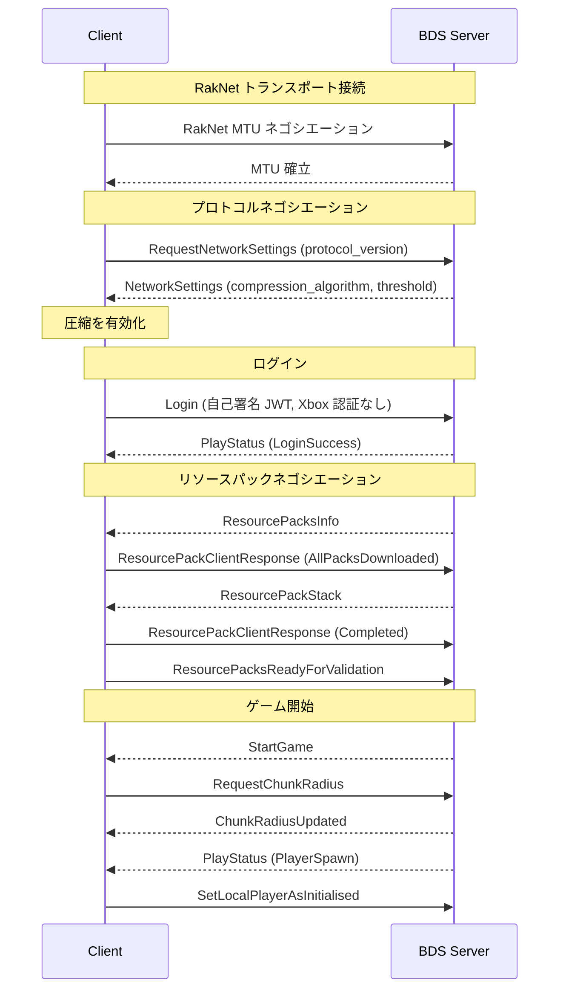
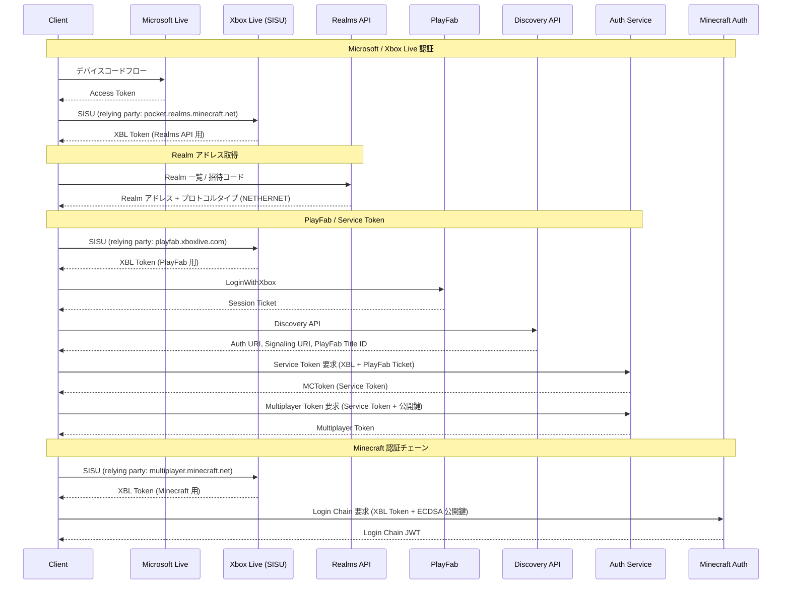
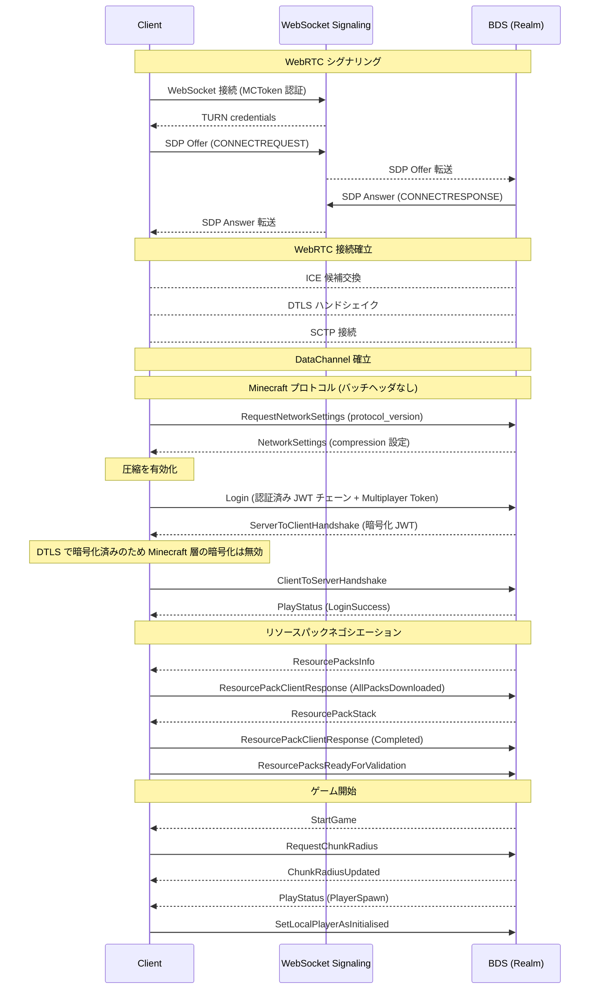

# 接続フロー詳細

BDS (ローカル/LAN) と Realms の接続フローを比較します。

## BDS (ローカル/LAN) 接続フロー

BDS への接続は RakNet (UDP) を使用し、認証は不要 (自己署名 JWT) です。



### ポイント

- **認証なし**: Dialer は自己署名の JWT を生成して Login パケットに含める
- **暗号化**: サーバー設定次第で ServerToClientHandshake による暗号化が有効になる場合がある (BDS ではデフォルト無効)
- **バッチヘッダ**: パケットは `0xFE` のバッチヘッダ付きで送受信される

## Realms 接続フロー

Realms への接続は2つのフェーズで構成されます: 認証フローと接続フロー。

### 1. 認証フロー

複数の認証サービスを経由してトークンを取得します。



### 2. 接続フロー (NetherNet / WebRTC)

認証完了後、WebRTC DataChannel で接続します。



## 比較表

| 項目 | BDS (ローカル) | Realms |
|------|---------------|--------|
| トランスポート | RakNet (UDP) | WebRTC DataChannel (DTLS/SCTP) |
| 認証 | なし (自己署名 JWT) | Xbox Live + Minecraft Chain JWT |
| 暗号化 | AES-256-CTR (Minecraft 層) | DTLS (トランスポート層、Minecraft 層は無効) |
| バッチヘッダ | あり (0xFE) | なし |
| Multiplayer Token | 不要 | 必要 |
| Network クラス | `RakNetNetwork` | `create_network()` (libdatachannel / aiortc) |
| シグナリング | なし | WebSocket (MCToken 認証) |
| PlayFab | 不要 | 必要 (Session Ticket → Service Token) |

## コード対比

### BDS 接続

```python
import asyncio
from mcbe.dial import Dialer
from mcbe.raknet import RakNetNetwork
from mcbe.proto.login.data import IdentityData

async def connect_bds():
    dialer = Dialer(
        identity_data=IdentityData(display_name="Steve"),
        network=RakNetNetwork(),
    )
    async with await dialer.dial("127.0.0.1:19132") as conn:
        print("BDS に接続完了!")
        while not conn.closed:
            pk = await conn.read_packet()
            print(f"Received: {type(pk).__name__}")
```

### Realms 接続

```python
import asyncio
from cryptography.hazmat.primitives.asymmetric import ec

from mcbe.auth.live import get_live_token
from mcbe.auth.xbox import request_xbl_token
from mcbe.auth.minecraft import request_minecraft_chain
from mcbe.auth.service import discover, request_service_token, request_multiplayer_token
from mcbe.auth.playfab import login_with_xbox as playfab_login
from mcbe.nethernet import create_network
from mcbe.realms import RealmsClient
from mcbe.dial import Dialer
from mcbe.proto.login.data import IdentityData

async def connect_realms():
    # 1. 認証
    live_token = await get_live_token()
    key = ec.generate_private_key(ec.SECP384R1())

    # 2. Realm アドレス取得
    xbl_realms = await request_xbl_token(live_token, "https://pocket.realms.minecraft.net/")
    async with RealmsClient(xbl_realms) as client:
        realms = await client.realms()
        realm_addr = await realms[0].address()

    # 3. PlayFab + Service Token
    xbl_pf = await request_xbl_token(live_token, "http://playfab.xboxlive.com/")
    discovery = await discover()
    playfab_ticket = await playfab_login(xbl_pf, title_id=discovery.playfab_title_id)
    service_token = await request_service_token(
        discovery.auth_uri, xbl_pf.auth_header_value(),
        playfab_title_id=discovery.playfab_title_id,
        playfab_session_ticket=playfab_ticket,
    )
    multiplayer_token = await request_multiplayer_token(
        discovery.auth_uri, service_token, key.public_key(),
    )

    # 4. NetherNet ネットワーク
    network = create_network(
        mc_token=service_token.authorization_header,
        signaling_url=discovery.signaling_info.service_uri,
    )

    # 5. Minecraft 認証チェーン
    xbl_mp = await request_xbl_token(live_token, "https://multiplayer.minecraft.net/")
    login_chain = await request_minecraft_chain(xbl_mp, key)

    # 6. 接続
    dialer = Dialer(
        identity_data=IdentityData(display_name="mcbe"),
        network=network,
        login_chain=login_chain,
        auth_key=key,
        multiplayer_token=multiplayer_token,
    )
    async with await dialer.dial(realm_addr.address) as conn:
        print("Realms に接続完了!")
        while not conn.closed:
            pk = await conn.read_packet()
            print(f"Received: {type(pk).__name__}")
```

### 主な違い

| 項目 | BDS | Realms |
|------|-----|--------|
| Network | `RakNetNetwork()` | `create_network(mc_token, signaling_url)` |
| `login_chain` | 不要 (自動生成) | `request_minecraft_chain()` で取得 |
| `auth_key` | 不要 (自動生成) | 明示的に `ec.generate_private_key()` |
| `multiplayer_token` | 不要 | `request_multiplayer_token()` で取得 |
| Dialer の `identity_data` | 表示名のみ | 認証チェーンに含まれる情報が使用される |
